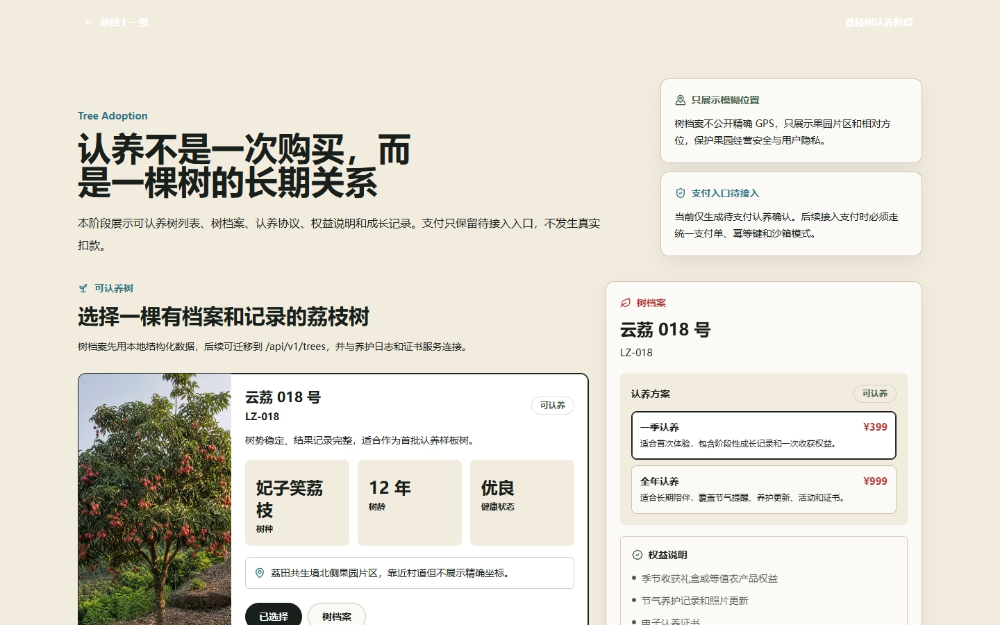
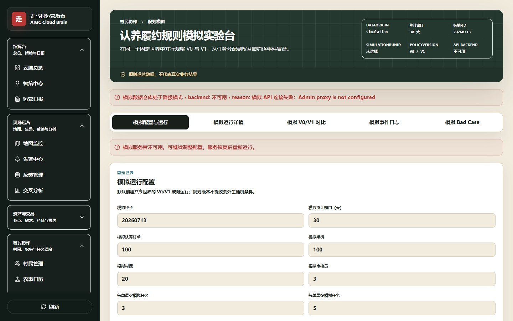

# Adopt a Tree, Connect with a Village

[](https://github.com/iyueyi110-rgb/Rural-operation-web-page/actions/workflows/ci.yml) [](https://github.com/iyueyi110-rgb/Rural-operation-web-page/actions/workflows/docs-check.yml) [](https://github.com/iyueyi110-rgb/Rural-operation-web-page/actions/workflows/simulation-regression.yml)

[简体中文](README.md) · [Documentation](docs/README.md) · [Product Requirements](docs/product/PRD.md) · [Rule Simulation](packages/simulation/README.md)


> Start with a lychee tree, build a lasting relationship with the land, and turn digital tools into a village operations system.

Adopt a Tree is a rural tourism adoption-fulfilment and benefit-management system. It connects tree selection, agreements, seasonal updates, care participation, benefit delivery, and harvest fulfilment with villager tasks, operational review, and exception handling.

## The problem it addresses

Many adoption projects stop after the initial sale. Care work, evidence, benefits, exceptions, and local collaboration then live in disconnected records. This project treats adoption as an ongoing service: adopters can follow each promise, villagers can see the next task, and operators can trace risks and evidence.

```text
Select and adopt → Tree profile → Care tasks and evidence → Review and exceptions → Benefits and harvest
                                      ↘ Local collaboration ↗
```

## Three core capabilities

### Adoption fulfilment loop

- Adopters: tree selection, adoption, growth timeline, interactions, renewal, refund, harvest, and shipment.
- Villagers: assigned work, notifications, evidence submission, and earning records.
- Operators: adoptions, tasks, review, settlement, alerts, and reports.

### Deterministic rule simulation

`@zouma/simulation` is a standalone, paired V0/V1 evaluation engine. Fixed seeds make runs reproducible across eight operational scenarios, thirteen metrics, and eleven export artifacts. The package currently has 60 automated tests.

> **Evidence boundary: simulated operational data does not represent real business outcomes.** The fixed 5-seed × 8-scenario matrix is used to expose policy gaps and define upgrade gates; it must not be presented as real efficiency or revenue improvement.

### Knowledge assistant and fixed evaluation

The local knowledge system combines BM25 retrieval, role filtering, PII sanitisation, and verbatim citation checks. In the fixed 24-question evaluation, retrieval recall was 20/20 for answerable questions and privileged operations content leakage was zero. Metrics that require live model outputs remain pending until a model is available.

## Screenshots

| Adoption entry | Operations simulation |
| --- | --- |
|  |  |

Screenshots use demonstration data and contain no real phone numbers, orders, precise coordinates, or payment information.

## Architecture

```text
Visitors / adopters / villagers                 Operators
              │                                    │
              ▼                                    ▼
       apps/web (Next.js)                 apps/admin (Next.js)
              └────────────────┬───────────────────┘
                               ▼
 contracts · database · knowledge · prompts · simulation · ui · utils
                               │
                               ▼
                     Prisma · PostgreSQL · Redis
```

| Area | Stack |
| --- | --- |
| Applications | Next.js 14, React 18, TypeScript |
| Data | Prisma, PostgreSQL, Redis |
| Engineering | pnpm workspace, Turborepo |
| Intelligent systems | Local retrieval, model adapters and fallbacks, deterministic simulation |

See [ARCHITECTURE.md](ARCHITECTURE.md) for the detailed design.

## Local development

Requires Node.js 20+, pnpm 11.6, and optionally Docker Desktop.

```bash
pnpm install --frozen-lockfile
pnpm dev
```

On Windows, double-click `start.cmd` or run:

```powershell
.\scripts\start.ps1 -SkipBrowser
```

Add `-SkipDB` to use repository-provided public fallback data. The root `走马村云脑系统.command` is the full macOS launcher; `scripts/start-adoption-simulation-macos.sh` starts the dedicated simulation workbench.

## Rule simulation

```bash
pnpm simulation:run --seed 20260713 --scenario NORMAL --output outputs/simulation/pair.json
pnpm simulation:regression --output outputs/simulation/regression-summary.json
pnpm simulation:compare --v0 run-v0.json --v1 run-v1.json --output comparison.json
pnpm simulation:export --seed 20260713 --scenario NORMAL
```

Supported scenarios: `NORMAL`, `ADOPTION_PEAK`, `STAFF_SHORTAGE`, `CONTINUOUS_RAIN`, `LOW_SUBMISSION_QUALITY`, `REMOTE_ZONE_LOAD`, `REVIEW_BACKLOG`, and `HARVEST_PEAK`.

## Quality gate

```bash
pnpm quality:gate
```

The gate runs type checks, tests, documentation checks, builds, and a fixed-seed simulation smoke test.

## Documentation

- [Product requirements and journeys](docs/product/PRD.md)
- [Product positioning and design principles](docs/product/PRODUCT_POSITIONING.md)
- [Project highlights](docs/product/HIGHLIGHTS.md)
- [Architecture](ARCHITECTURE.md)
- [Simulation design](docs/simulation/system-design.md)
- [Metric definitions](docs/simulation/metrics-definition.md)
- [Regression conclusions and interview material](docs/simulation/resume-analysis.md)
- [Contributing guide](CONTRIBUTING.md)

## Usage boundary

This repository does not currently declare an open-source licence. Redistribution or commercial use requires explicit permission from the rights holder. See [SECURITY.md](SECURITY.md) for responsible disclosure guidance.
