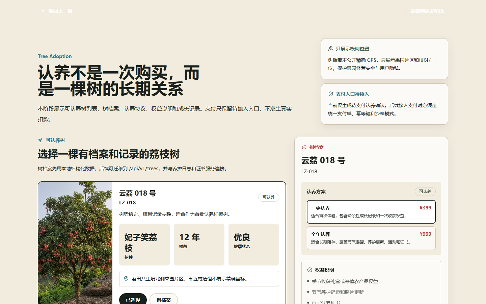
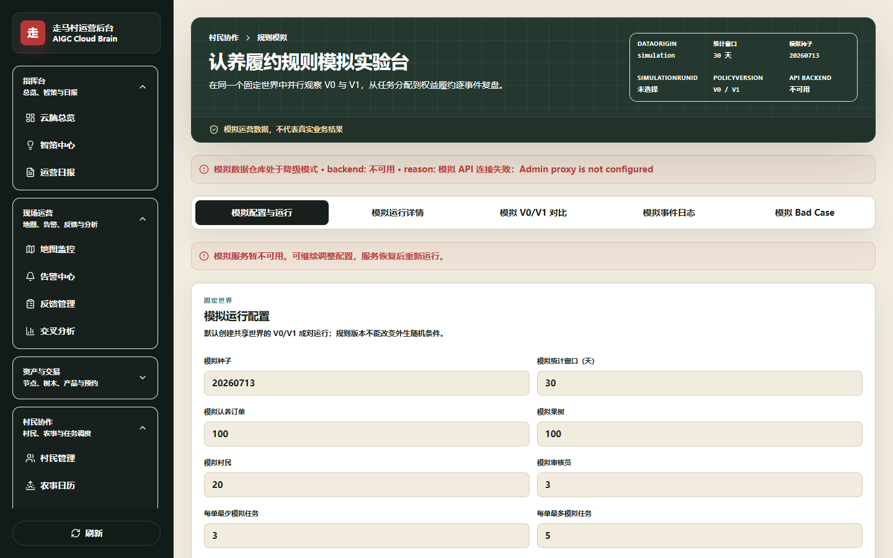

# 认养一棵树，连接一个村

[](https://github.com/iyueyi110-rgb/Rural-operation-web-page/actions/workflows/ci.yml) [](https://github.com/iyueyi110-rgb/Rural-operation-web-page/actions/workflows/docs-check.yml) [](https://github.com/iyueyi110-rgb/Rural-operation-web-page/actions/workflows/simulation-regression.yml)

> 面向乡村文旅的认养履约与权益管理作品集：用可追踪流程连接认养用户、村民履约人员和村级运营方，用规则模拟与固定评测验证产品决策。

**快速入口：** [30 秒招聘证据](docs/portfolio/README.md) · [产品需求](docs/product/PRD.md) · [业务与设计原则](docs/product/PRODUCT_POSITIONING.md) · [规则模拟](packages/simulation/README.md) · [技术架构](ARCHITECTURE.md) · [文档中心](docs/README.md)


## 30 秒看懂项目

传统认养项目容易停在“一次性售树”，后续养护、凭证、权益、异常和村民协作缺少统一记录。我把认养关系定义为一项持续履约服务，并围绕三类角色设计闭环：

- **认养用户：** 选树、认养、查看成长与履约、参与养护、续养、退款、采收和配送。
- **村民履约人员：** 接收任务、提交凭证、处理退回、查看收益和下一步工作。
- **村级运营方：** 审核凭证、处理异常、管理权益与结算、查看预警和报告。

```text
选树与签约 → 树档案与成长记录 → 养护任务与凭证 → 审核与异常处理 → 权益兑现与收获
                                  ↘ 村民协作 ↗
```

核心交易和状态流不依赖 AI。AI 只处理文本摘要、分类和建议草稿；养护凭证、退款判责、结算和状态变更等高风险节点始终由人确认。

## 本人与 AI 的分工

| 环节 | 本人负责 | AI 协助 | 本人如何验收与决策 |
| --- | --- | --- | --- |
| 问题定义 | 实地沟通、场景判断、候选方向比较、确定认养链路和角色优先级 | 整理访谈摘要、备选假设和问题清单 | 核对真实样本与业务边界，决定保留或否决假设 |
| 业务规则 | 定义角色、状态、异常、人工审核节点和升级门槛 | 生成初版流程文档、状态实现和测试草稿 | 用异常案例与状态机测试复核，不允许 AI 直接决定退款、结算或状态变更 |
| 原型与代码 | 定义交互要求、验收标准和版本取舍 | 搭建页面、接口、测试与重构代码 | 本地运行、复现 Bad Case、检查安全边界并决定是否合并 |
| 数据结论 | 定义指标分子分母、排除条件、护栏和升级标准 | 执行固定种子模拟、聚合结果和生成报告草稿 | 核对口径、抽样记录和反证，最终决定暂缓升级 |

## 验证结论与版本决策

### 规则模拟

`@zouma/simulation` 使用 5 个固定种子 × 8 类运营场景进行 40 组 V0/V1 同世界成对回归，每组共享配置和 `worldHash`，比较 13 项指标与显式升级门槛。

> **模拟运营数据，不代表真实业务结果。** 模拟结果只用于发现规则缺口、校准护栏和决定下一轮实验，不能证明真实用户增长、村民效率或运营收益。

V1 在按时提交、最终审核和人工介入等模拟过程指标上出现改善，但公平性、验收率和容量相关护栏并未在全部场景同步改善，因此 40 组结论均为“模拟结果暂不支持升级”。具体口径、结果和复现路径见[招聘证据索引](docs/portfolio/README.md)。

### 知识助手与 Agent

- 本地知识系统使用 BM25 检索、角色过滤、PII 清洗和逐字引用校验；固定 24 题中，20 条可回答问题检索召回为 20/20，运营专属内容泄漏为 0。
- 依赖真实模型输出的回答忠实度、引用准确率和综合拒答准确率尚未完成，不写成已验证结果。
- 履约协调 Agent 仅处于影子模式，只能读取必要信息并生成建议；退款、判责、结算和状态修改不授权给 Agent。

## 产品截图

| 用户端认养入口 | 运营端规则模拟 |
| --- | --- |
|  |  |

截图使用演示数据，不包含真实手机号、订单、精确坐标或支付信息。

## 技术架构

```text
游客 / 认养用户 / 村民协作者              运营人员
              │                              │
              ▼                              ▼
     apps/web（Next.js）          apps/admin（Next.js）
              └──────────────┬───────────────┘
                             ▼
 contracts · database · knowledge · prompts · simulation · ui · utils
                             │
                             ▼
                   Prisma · PostgreSQL · Redis
```

| 类别 | 技术 |
| --- | --- |
| 应用 | Next.js 14、React 18、TypeScript |
| 数据 | Prisma、PostgreSQL、Redis |
| 工程 | pnpm workspace、Turborepo |
| 智能能力 | 本地知识检索、模型适配与安全降级、确定性规则模拟 |

详细设计见[技术架构](ARCHITECTURE.md)。

## 本地运行

要求 Node.js 20+、pnpm 11.6 和可选的 Docker Desktop。

```bash
pnpm install --frozen-lockfile
pnpm dev
```

Windows 可双击 `start.cmd`，或运行：

```powershell
.\scripts\start.ps1 -SkipBrowser
```

只演示仓库内公开降级数据时可增加 `-SkipDB`。macOS 完整系统入口为根目录 `走马村云脑系统.command`。

规则模拟固定种子冒烟运行：

```bash
pnpm simulation:run --seed 20260713 --scenario NORMAL
```

## 质量门禁

```bash
pnpm quality:gate
```

该命令统一执行类型检查、测试、文档检查、构建和规则模拟冒烟测试。

## 使用与证据边界

- 本仓库是公开可见的作品集，不代表真实认养业务已经上线。
- 仓库未授予开源许可；未经权利人明确许可，不得再分发或用于商业用途。
- 在线 Demo 只有在多网络环境验活后才会加入，不使用失效链接或占位入口。
- 安全问题、隐私信息和凭证处理方式见[安全与使用边界](SECURITY.md)。
