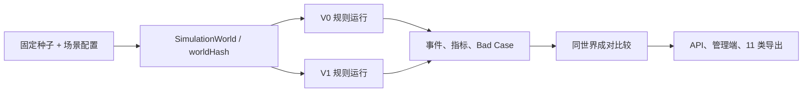

# 认养履约规则模拟系统

> 模拟运营数据，不代表真实业务结果。

## 范围与架构

系统在同一份固定基础世界上运行 V0 与 V1，覆盖认养、任务生成、分配、接单、执行、提交、规则预检查、审核、退回、延期、重新分配、权益履约与结算。`packages/simulation` 是不依赖浏览器、数据库、网络或大模型的纯 TypeScript 引擎；`apps/web` 提供管理员 API 和三层存储降级；`apps/admin` 提供“村民协作 / 规则模拟”工作台。

V0/V1 共享 `seed`、场景、配置和 `worldHash`。策略只能改变分配、提醒、提交模板、预检查、审核排序和天气延期，不能改变村民基础能力或外生随机结果。引擎禁止 `Math.random()`、`Date.now()` 和真实网络请求。

## 数据隔离与不可变性

Prisma 只新增 `SimulationWorld`、`SimulationRun`、`SimulationEvent` 和 `SimulationBadCase`。模拟记录的 `dataOrigin` 固定为 `simulation`，运行产物包含 `simulationRunId`、`policyVersion` 和不可变 `policyRevision`。完成运行不能覆盖；删除操作仅写 `archivedAt`；重新运行通过克隆配置生成新 ID。

仓库优先级：Prisma → `tmp/simulation-store/` JSON → 进程内存。三种实现返回相同 DTO；后两种响应携带 `meta.degraded=true`。任何路径都不得写 `TreeAdoption`、`Task`、`PaymentOrder` 或 `UnifiedOrder`。

## 状态与事件

认养主链：`created → pending_payment → paid → active → harvest_ready → fulfillment_pending → completed`。任务主链：`created → assigned → accepted → in_progress → submitted → approved → completed`。拒单、退回、逾期、重派、取消、退款与争议使用显式分支；每次变化只追加 `SimulationEvent`，禁止覆盖历史。

事件可按运行、认养、任务、实体、行为人、事件类型、策略版本和时间筛选。Bad Case 固定分类为库存不足、分配耗尽、逾期、质量退回、审核积压、权益延迟和异常漏检，并保存完整 `eventIds` 证据链。

## API 与操作路径

管理员 API 前缀为 `/api/v1/simulations`：

- `POST/GET /runs`：创建单策略或 V0/V1 成对运行、列表筛选。
- `GET/DELETE /runs/:id`：详情与软归档。
- `POST /runs/:id/clone`：复制配置并产生新运行。
- `POST /comparisons`：同世界比较，不匹配返回 422。
- `GET /events`：筛选事件和实体链。
- `GET/PATCH /bad-cases`：复盘根因和改进动作。
- `GET /exports/:artifact`：下载 JSON、CSV 或 Markdown。

管理端路径为 `/simulations`。完整验收路径：配置 → 一键运行 V0/V1 → 详情与漏斗 → 对比 → 事件链 → Bad Case 复盘 → 导出。

## 导出

固定生成 11 类文件：配置、运行、事件、任务、分配、提交、审核、Bad Case、指标、比较和 Markdown 报告。报告首部展示 Demo 阶段、固定种子、来源、两个运行 ID、规则修订及真实性声明。
